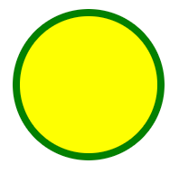
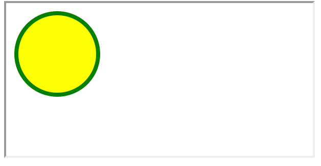

- 本文介绍了在 html 文件中引入 svg 资源的实现方式，可以通过下面这 4 种方式来在 html 中嵌入 svg：
  1. 通过 img 标签来嵌入 svg
  2. 通过直接嵌入源码的方式来嵌入 svg
  3. 通过 iframe 来嵌入 svg
  4. 通过 object 来嵌入 svg
- 如果你写好了一个 svg 文件，想要知道如何将其引入到前端页面上，可以参考下文中提到的一些做法。

## 1. demos.1 - 准备测试用的 svg 图形

```xml
<?xml version="1.0" encoding="UTF-8"?>
<svg width="100" height="100" xmlns="http://www.w3.org/2000/svg">
  <circle cx="50" cy="50" r="40" stroke="green" stroke-width="4" fill="yellow" />
</svg>
```

- 

## 2. demos.2 - 通过 img 标签来嵌入 svg

```html
<!DOCTYPE html>
<html lang="en">
  <head>
    <meta charset="UTF-8" />
    <meta name="viewport" content="width=device-width, initial-scale=1.0" />
    <title>通过 img 标签来嵌入 svg</title>
  </head>
  <body>
    
  </body>
</html>
```

- 

## 3. demos.3 - 通过直接嵌入源码的方式来嵌入 svg

```html
<!DOCTYPE html>
<html lang="en">
  <head>
    <meta charset="UTF-8" />
    <meta name="viewport" content="width=device-width, initial-scale=1.0" />
    <title>通过直接嵌入源码的方式来嵌入 svg</title>
  </head>
  <body>
    <!-- 在 html 文档中直接插入 svg，其中 版本声明 和 xmlns 声明啥的是可以省略的 -->
    <!-- <?xml version="1.0" encoding="UTF-8"?>
    <svg width="100" height="100" xmlns="http://www.w3.org/2000/svg">
      <circle
        cx="50"
        cy="50"
        r="40"
        stroke="green"
        stroke-width="4"
        fill="yellow"
      />
    </svg> -->
    <!-- 等效写法： -->
    <svg width="100" height="100">
      <circle
        cx="50"
        cy="50"
        r="40"
        stroke="green"
        stroke-width="4"
        fill="yellow"
      />
    </svg>
  </body>
</html>
```

- 

## 4. demos.4 - 通过 iframe 来嵌入 svg

```html
<!DOCTYPE html>
<html lang="en">
  <head>
    <meta charset="UTF-8" />
    <meta name="viewport" content="width=device-width, initial-scale=1.0" />
    <title>通过 iframe 来嵌入 svg</title>
  </head>
  <body>
    <iframe src="./1.svg"></iframe>
  </body>
</html>
```

- 

## 5. demos.5 - 通过 object 标签来嵌入 svg

```html
<!DOCTYPE html>
<html lang="en">
  <head>
    <meta charset="UTF-8" />
    <meta name="viewport" content="width=device-width, initial-scale=1.0" />
    <title>通过 object 来嵌入 svg</title>
  </head>
  <body>
    <object data="./1.svg"></object>
  </body>
</html>
```

- 
