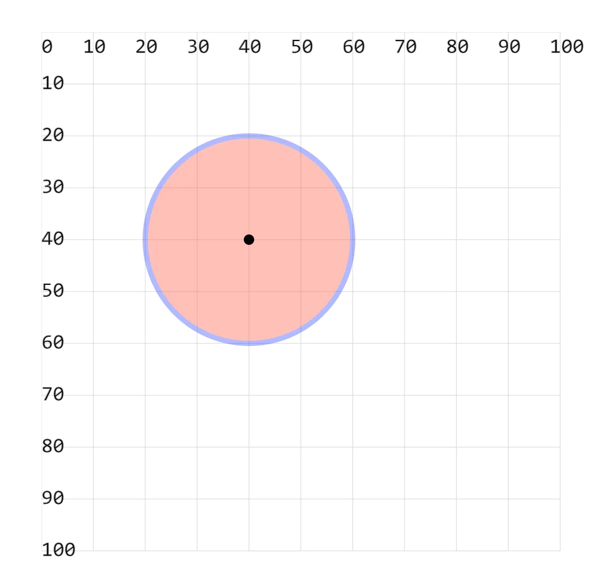
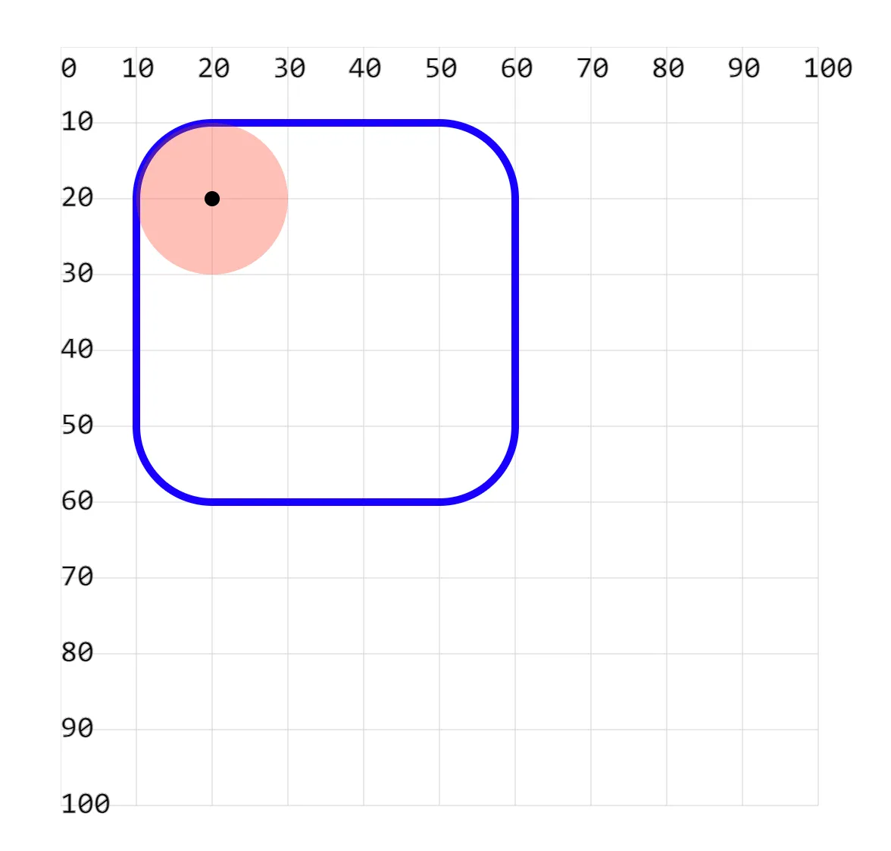

# [0003. 使用 circle 绘制圆形](https://github.com/tnotesjs/TNotes.svg/tree/main/notes/0003.%20%E4%BD%BF%E7%94%A8%20circle%20%E7%BB%98%E5%88%B6%E5%9C%86%E5%BD%A2)

<!-- region:toc -->

- [1. demos.1 - 使用 circle 绘制圆形](#1-demos1---使用-circle-绘制圆形)
- [2. demos.2 - 使用 circle 绘制圆形](#2-demos2---使用-circle-绘制圆形)

<!-- endregion:toc -->

- 绘制一个圆需要知道的信息：
  1. 圆心的坐标 `cx` `cy`
  2. 绘制的圆的半径 `r`

## 1. demos.1 - 使用 circle 绘制圆形

```xml
<svg style="margin: 3rem;" width="500px" height="500px" viewBox="0 0 120 120" xmlns="http://www.w3.org/2000/svg">
  <!--
    cx 和 cy 在坐标系设置圆心位置
    cx 全称 Center X  表示圆心的横坐标
    cy 全称 Center Y  表示圆心的纵坐标

    r 设置圆的半径
    r  全称 Radius    表示圆的半径

    fill 设置填充颜色
    opacity 设置透明度
    stroke 设置边框颜色
    -->
  <circle cx="40" cy="40" r="20" fill="red" opacity=".3" stroke="blue" /> <!-- [!code highlight] -->

  <!-- 标注出圆心 -->
  <circle cx="40" cy="40" r="1" fill="#000"/> <!-- [!code highlight] -->
</svg>
```

- 

## 2. demos.2 - 使用 circle 绘制圆形

```xml
<svg style="margin: 3rem;" width="500px" height="500px" viewBox="0 0 120 120" xmlns="http://www.w3.org/2000/svg">
  <!-- 绘制一个圆角矩形，rx 和 ry 设置为 10 -->
  <rect x="10" y="10" width="50" height="50" fill="none" stroke="blue" rx="10" ry="10" /> <!-- [!code highlight] -->
  <!-- 在圆角矩形的左上角绘制一个半径也是 10 的圆 -->
  <circle cx="20" cy="20" r="10" fill="red" opacity=".3" /> <!-- [!code highlight] -->
  <!-- 标注出圆的圆心 -->
  <circle cx="20" cy="20" r="1" fill="black" /> <!-- [!code highlight] -->
</svg>
```

- 
