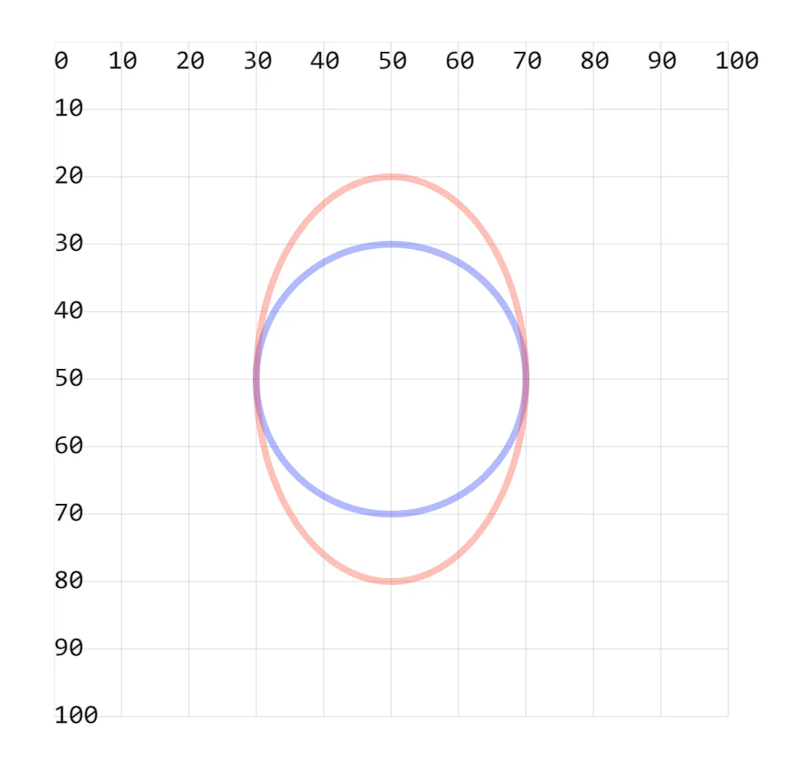

- 绘制椭圆需要知道的信息：
  1. 椭圆的圆心 cx cy
  2. 椭圆的 x 轴半径 rx
  3. 椭圆的 y 轴半径 ry
- 如果 rx = ry，那么其实绘制的就是一个圆。

## 1. demos.1 - 使用 `<ellipse>` 绘制椭圆形

```xml
<svg style="margin: 3rem;" width="500px" height="500px" viewBox="0 0 120 120" xmlns="http://www.w3.org/2000/svg">
  <!--
  cx 和 cy 在坐标系设置原点
    cx: Center X - 椭圆中心的横坐标。
    cy: Center Y - 椭圆中心的纵坐标。

  rx 和 ry 设置 x 轴半径和 y 轴半径
    rx: Radius X - 椭圆的水平半径，即椭圆中心到椭圆最左侧或最右侧的距离。
    ry: Radius Y - 椭圆的垂直半径，即椭圆中心到椭圆最上方或最下方的距离。

  提示：如果将 rx 和 ry 设置为相同的值，那么就会绘制一个圆形。
  -->
  <ellipse cx="50" cy="50" rx="20" ry="20" fill="none" stroke="blue" opacity=".3" /> <!-- [!code highlight] -->
  <ellipse cx="50" cy="50" rx="20" ry="30" fill="none" stroke="red" opacity=".3" /> <!-- [!code highlight] -->
</svg>
```

- 
