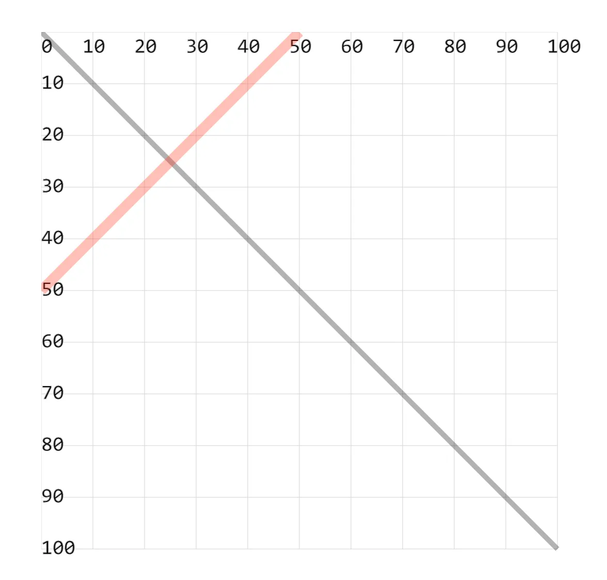

- 绘制直线，只需要明确起点坐标 `(x1, y1)` 和终点坐标 `(x2, y2)` 即可。

## 1. demos.1 - 使用 `<line>` 绘制直线

```xml
<svg style="margin: 3rem;" width="500px" height="500px" viewBox="0 0 120 120" xmlns="http://www.w3.org/2000/svg">
  <!-- 坐标系网格 -->
  <!-- <g font-size="4" stroke="lightgray" stroke-width=".1">...</g> -->

  <!-- x1 y1 和 x2 y2 设置线段的两个坐标点，两点之间绘制线段。 -->
  <!-- fill 属性是无效的，因为线段没有填充区域。 -->
  <line x1="0" y1="0" x2="100" y2="100" stroke="black" stroke-width="1" opacity=".3" /> <!-- [!code highlight] -->
  <line x1="0" y1="50" x2="50" y2="0" stroke="red" stroke-width="2" opacity=".3" /> <!-- [!code highlight] -->
</svg>
```


