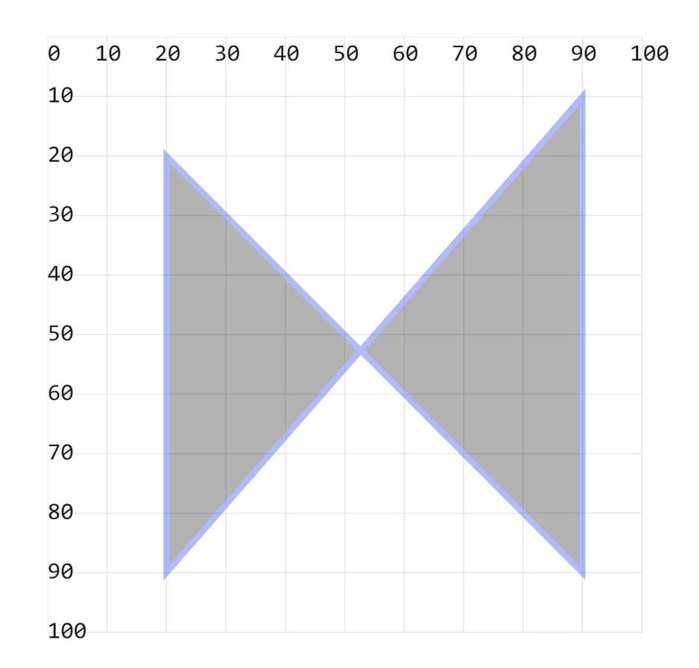

# [0006. 使用 polygon 绘制多边形](https://github.com/tnotesjs/TNotes.svg/tree/main/notes/0006.%20%E4%BD%BF%E7%94%A8%20polygon%20%E7%BB%98%E5%88%B6%E5%A4%9A%E8%BE%B9%E5%BD%A2)

<!-- region:toc -->

- [1. demos.1 - 使用 `<polygon>` 绘制多边形](#1-demos1---使用-polygon-绘制多边形)

<!-- endregion:toc -->

## 1. demos.1 - 使用 `<polygon>` 绘制多边形

```xml
<svg style="margin: 3rem;" width="500px" height="500px" viewBox="0 0 120 120" xmlns="http://www.w3.org/2000/svg">
  <!--
  多边形与折线的绘制类似，不同在于终端节点和起始节点自动联通，完成闭合，并有默认颜色填充。
  -->
  <polygon // [!code highlight]
    points="20 20, 90 90, 90 10, 20 90" // [!code highlight]
    stroke="blue" // [!code highlight]
    stroke-width="1" // [!code highlight]
    opacity=".3" // [!code highlight]
  /> <!-- [!code highlight] -->
</svg>
```

- 
