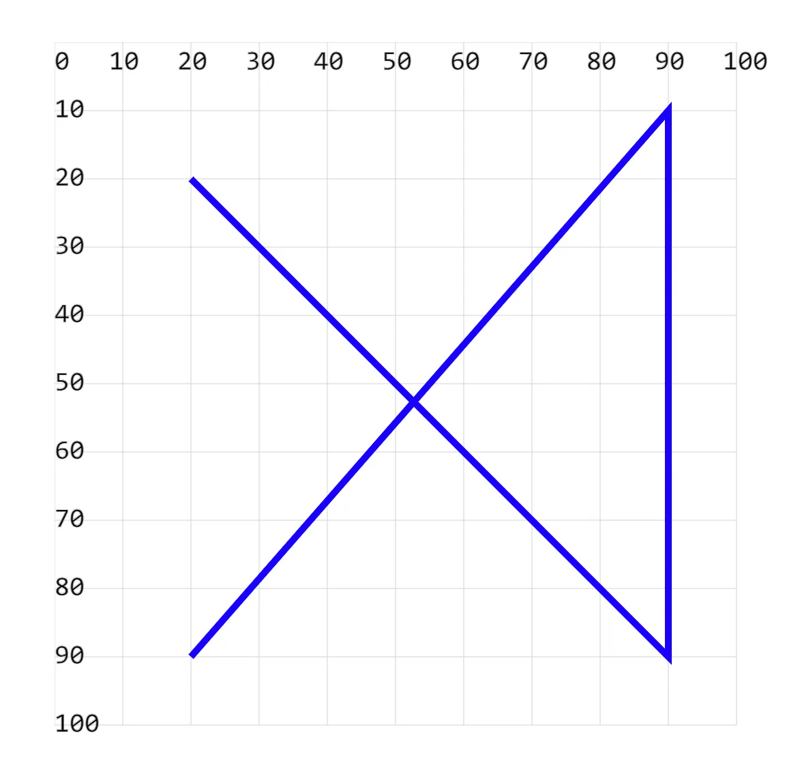
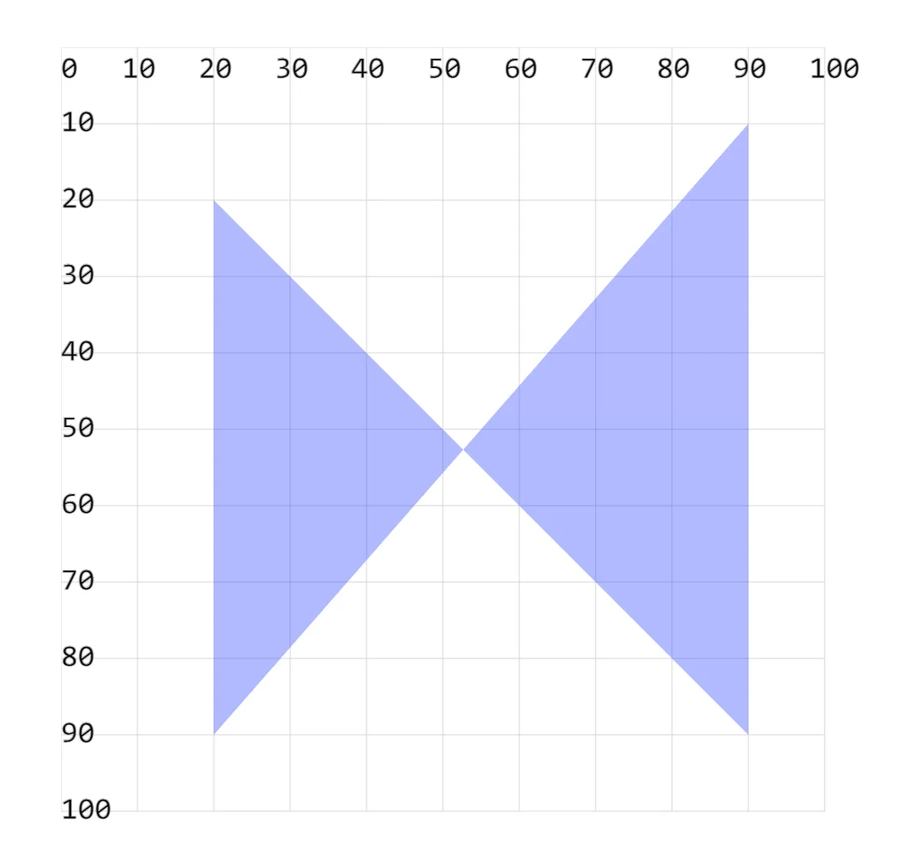

- 绘制折线的写法很简单，挨个标注点，渲染的时候会按照顺序将我们写的点连起来形成折线。

## 1. demos.1 - 使用 `<polyline>` 绘制折线

```xml
<svg style="margin: 3rem;" width="500px" height="500px" viewBox="0 0 120 120" xmlns="http://www.w3.org/2000/svg">
  <!--
  多个点，依次绘制直线，最终形成一个折线效果。
  points 设置多个点的坐标值集合。
  每一对表示一个点在坐标，每一个值可以使用【空格】或【逗号】隔开。
  -->
  <polyline points="20 20, 90 90, 90 10, 20 90" fill="none" stroke="blue" stroke-width="1"/> <!-- [!code highlight] -->
</svg>
```



## 2. demos.2 - 使用 `<polyline>` 绘制折线并填充

```xml
<svg style="margin: 3rem;" width="500px" height="500px" viewBox="0 0 120 120" xmlns="http://www.w3.org/2000/svg">
  <!--
  【fill 属性】
  折线 polyline 和线段 line 不同
    折线 polyline 的各个点，可以组成一个闭合的多边形，而线段 line 是两个点之间的直线。
    因此 fill 属性对于折线来说是有效的，而对于线段来说是无效的。
  -->
  <polyline points="20 20, 90 90, 90 10, 20 90" fill="blue" opacity=".3" /> <!-- [!code highlight] -->
</svg>
```


