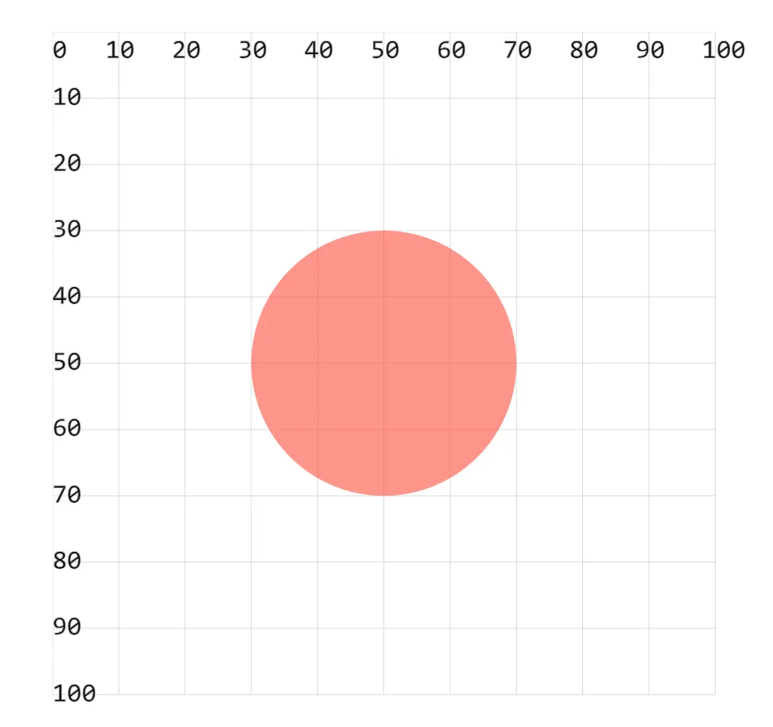

- fill 设置填充颜色
- fill-opacity 设置填充透明度

## 1. demos.1 - 使用属性 fill、fill-opacity 设置填充样式

```xml
<!--
1. fill：图形区域的颜色填充（背景颜色）。
2. fill-opacity：设置填充颜色的透明度。
-->
<svg style="margin: 3rem;" width="500px" height="500px" viewBox="0 0 120 120" xmlns="http://www.w3.org/2000/svg">
  <circle cx="50" cy="50" r="20" fill="red" fill-opacity=".5" />
</svg>
```


