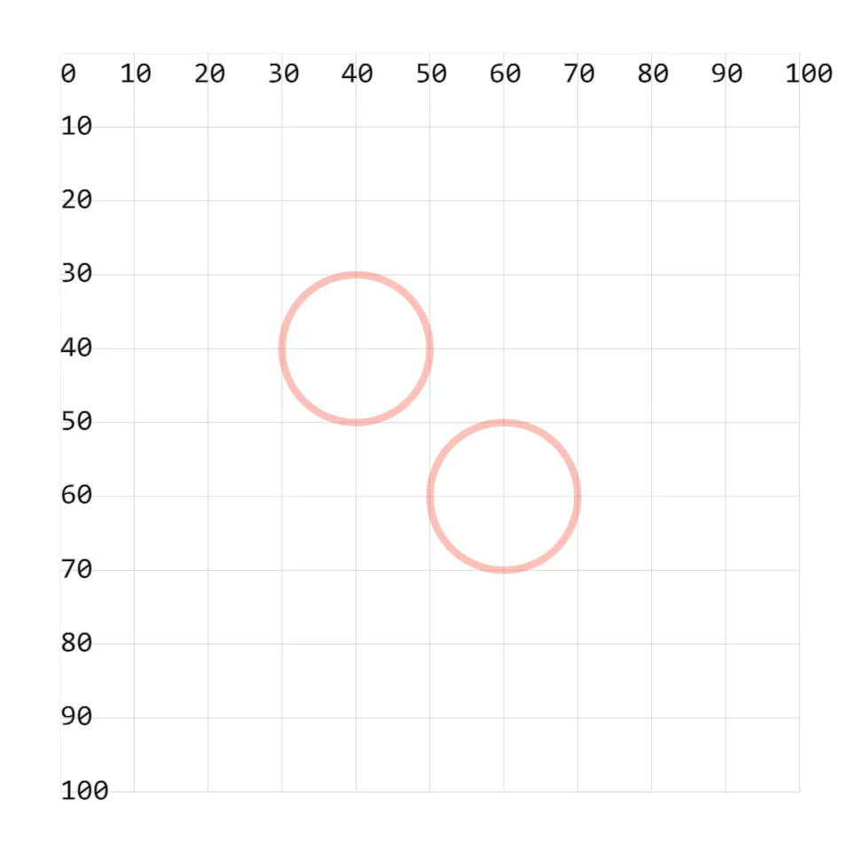
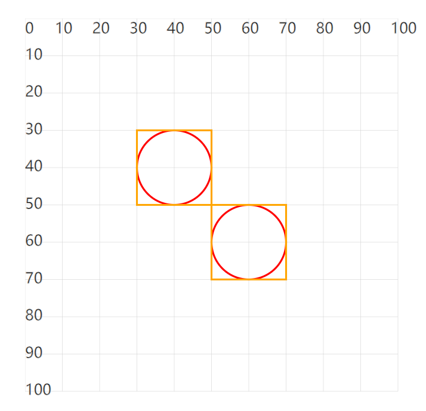

# [0016. 使用 defs 定义图形](https://github.com/tnotesjs/TNotes.svg/tree/main/notes/0016.%20%E4%BD%BF%E7%94%A8%20defs%20%E5%AE%9A%E4%B9%89%E5%9B%BE%E5%BD%A2)

<!-- region:toc -->

- [1. demos.1 - 使用 defs 定义图形](#1-demos1---使用-defs-定义图形)
- [2. demos.2 - defs + g + use](#2-demos2---defs--g--use)

<!-- endregion:toc -->

- `<defs>` 用于定义图形，使用 `<defs>` 定义的元素不会直接显示，除非被其他 SVG 元素通过引用使用，通常配合 `<use>`、`<g>` 一起使用。

## 1. demos.1 - 使用 defs 定义图形

```xml
<svg style="margin: 3rem;" width="500px" height="500px" viewBox="0 0 120 120" xmlns="http://www.w3.org/2000/svg">
  <!--
  defs 用于定义可重用的元素。
  defs 本身并不显示，通常用于配合 use 在多个地方复用。
  -->
  <defs>
    <circle id="c1" cx="20" cy="20" r="10" stroke="red" fill="none" opacity=".3" />
  </defs>

  <use href="#c1" x="20" y="20" />
  <use href="#c1" x="40" y="40" />
  <!--
  use 复用 c1
  第一个 use 的圆心位置是 (40, 40)
  第一个 use 的圆心位置是 (60, 60)
   -->
</svg>
```



## 2. demos.2 - defs + g + use

```xml
<svg style="margin: 3rem;" width="500px" height="500px" viewBox="0 0 120 120" xmlns="http://www.w3.org/2000/svg">
  <!--
  defs + g + use
  -->
  <defs>
    <g id="g1" fill="none" stroke-width=".5">
      <circle cx="20" cy="20" r="10" stroke="red" />
      <rect x="10" y="10" width="20" height="20" stroke="orange" />
    </g>
  </defs>

  <use href="#g1" x="20" y="20" />
  <use href="#g1" x="40" y="40" />
</svg>
```


