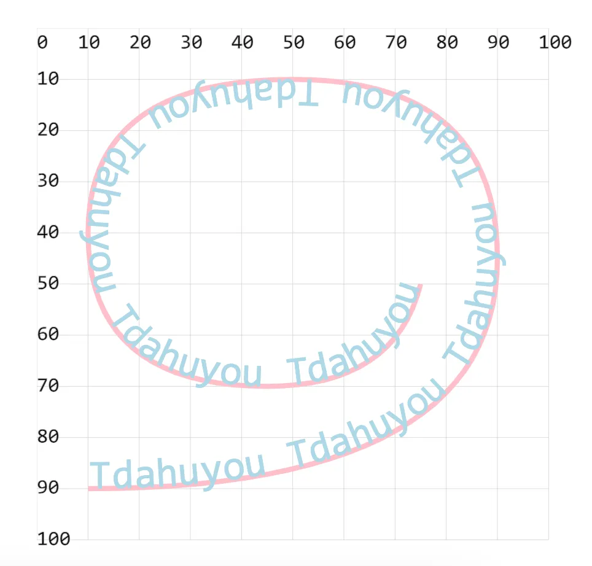

# [0018. 使用 textPath 实现按照指定路径绘制文本](https://github.com/tnotesjs/TNotes.svg/tree/main/notes/0018.%20%E4%BD%BF%E7%94%A8%20textPath%20%E5%AE%9E%E7%8E%B0%E6%8C%89%E7%85%A7%E6%8C%87%E5%AE%9A%E8%B7%AF%E5%BE%84%E7%BB%98%E5%88%B6%E6%96%87%E6%9C%AC)

<!-- region:toc -->

- [1. demos.1 - textPath 基本使用](#1-demos1---textpath-基本使用)

<!-- endregion:toc -->

- 看下文档中提供的 demo 效果，很容易理解其作用。效果蛮惊艳的，不过不太常见。

## 1. demos.1 - textPath 基本使用

```xml
<!--
textPath mdn doc => https://developer.mozilla.org/zh-CN/docs/Web/SVG/Element/textPath

textPath 用于将文本沿着指定的路径进行排列，使文本能够遵循任何复杂形状或曲线，从而创造动态和视觉上吸引人的文本效果。

文字将按照 path 路径来展现。

<textPath> 使用 href 属性，链接指定 id 的 path 图形。
-->
<svg style="margin: 3rem;" width="500px" height="500px" viewBox="0 0 120 120" xmlns="http://www.w3.org/2000/svg">
  <path id="MyPath" fill="none" stroke="pink" // [!code highlight]
    d="M10,90 Q90,90 90,45 Q90,10 50,10 Q10,10 10,40 Q10,70 45,70 Q70,70 75,50" /> <!-- [!code highlight] -->

  <text fill="lightblue" font-size="8">
    <textPath href="#MyPath"> <!-- [!code highlight] -->
      Tdahuyou
      Tdahuyou
      Tdahuyou
      Tdahuyou
      Tdahuyou
      Tdahuyou
      Tdahuyou
      Tdahuyou
    </textPath>
  </text>
</svg>
```

- 
