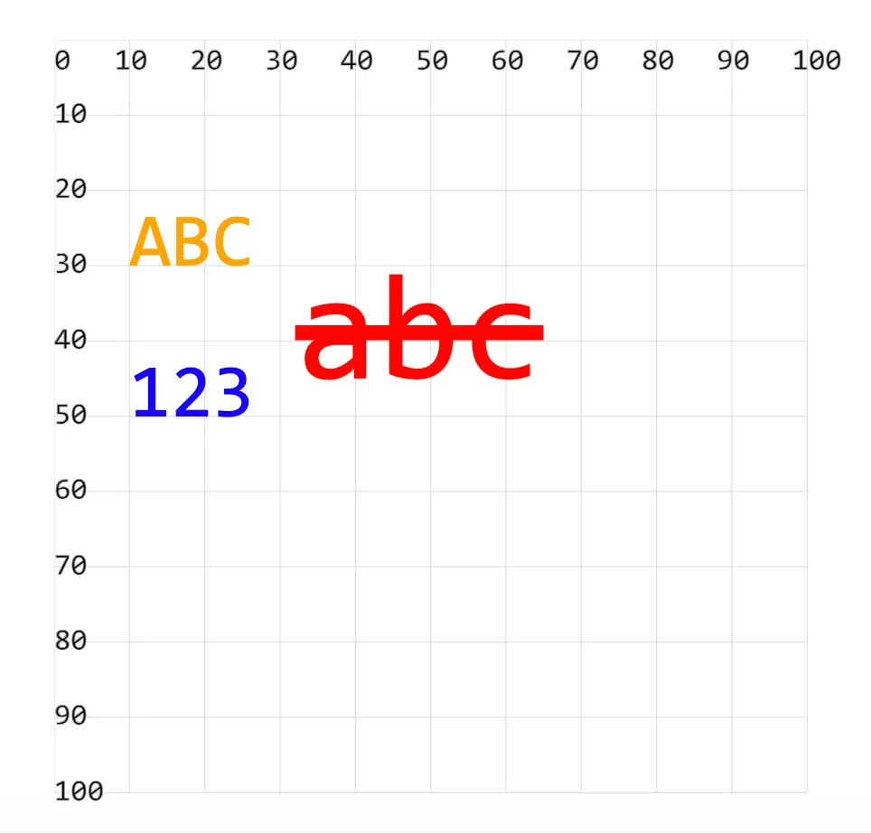
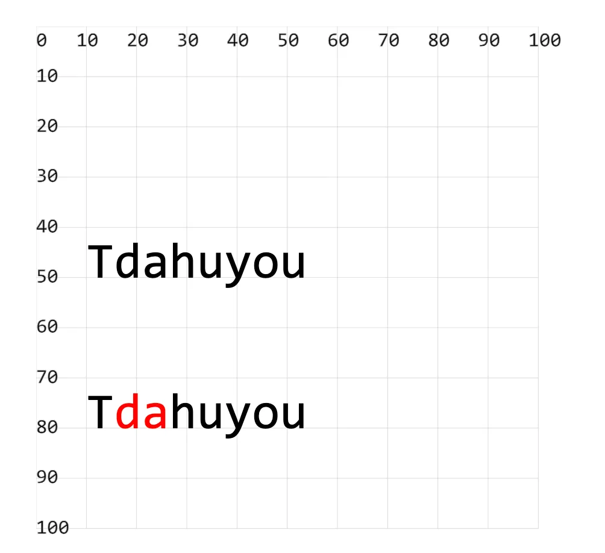

- tspan 是 text 中的子元素，可以更细粒度地去控制文本内容。如果有控制一段文本中的一部分内容的需求，这玩意儿还是很有用的。

## 1. demos.1 - tspan 的基本使用

```xml
<!--
mdn doc => https://developer.mozilla.org/zh-CN/docs/Web/SVG/Element/tspan

<tspan> 在 SVG 中用于在文本内部进行更细粒度的文本排列和样式控制。
它可以单独设置一段文本的属性，如坐标、颜色、字体等，允许在一个更大的文本块中创建复杂的文本布局。

tspan 用于包裹部分文字，对这部分文字单独做设置。

x 和 y 基于坐标轴原点，重新设置子部分文字的位置。
dx 和 dy 相对于这部分文字原来的位置，重新设置新位置。
-->
<svg style="margin: 3rem;" width="500px" height="500px" viewBox="0 0 120 120" xmlns="http://www.w3.org/2000/svg">
  <text x="10" y="50" font-size="10" fill="blue">
    123
    <tspan dy="-5" font-size="20" fill="red" text-decoration="line-through">abc</tspan> <!-- [!code highlight] -->
    <tspan x="10" y="30" font-size="10" fill="orange">ABC</tspan> <!-- [!code highlight] -->
  </text>
</svg>
```

- 

## 2. demos.2 - tspan 的基本使用

```xml
<!--
比如 Tdahuyou 文本渲染，现在想要让 da 变为红色，其他都保持默认样式。

结构 1：
<text>Tdahuyou</text>
这种结构不好控制文本中部分文字的样式。

结构 2：
<text>T<tspan>da</tspan>huyou</text>
这种结构可以控制部分文字的样式，只需要使用 <tspan> 包裹需要设置样式的文字即可。
-->
<svg style="margin: 3rem;" width="500px" height="500px" viewBox="0 0 120 120" xmlns="http://www.w3.org/2000/svg">
  <!-- 结构 1 -->
  <text x="10" y="50" font-size="10">
    Tdahuyou
  </text>

  <!-- 结构 2 -->
  <text x="10" y="80" font-size="10">
    T<tspan fill="red">da</tspan>huyou <!-- [!code highlight] -->
  </text>
</svg>
```

- 
