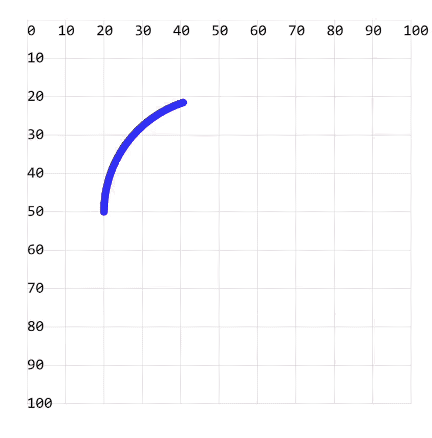

# [0023. 【练习】使用 stroke-dasharray 模拟加载中动画效果](https://github.com/Tdahuyou/TNotes.svg/tree/main/notes/0023.%20%E3%80%90%E7%BB%83%E4%B9%A0%E3%80%91%E4%BD%BF%E7%94%A8%20stroke-dasharray%20%E6%A8%A1%E6%8B%9F%E5%8A%A0%E8%BD%BD%E4%B8%AD%E5%8A%A8%E7%94%BB%E6%95%88%E6%9E%9C)

<!-- region:toc -->

- [1. 💻 demos.1 - 使用 stroke-dasharray 模拟加载中动画效果](#1--demos1---使用-stroke-dasharray-模拟加载中动画效果)

<!-- endregion:toc -->

## 1. 💻 demos.1 - 使用 stroke-dasharray 模拟加载中动画效果

```xml
<!DOCTYPE html>
<html lang="en">
  <head>
    <meta charset="UTF-8" />
    <meta name="viewport" content="width=device-width, initial-scale=1.0" />
    <title>Document</title>
  </head>
  <body>
    <svg
      style="margin: 3rem"
      width="500px"
      height="500px"
      viewBox="0 0 120 120"
      xmlns="http://www.w3.org/2000/svg"
    >
      <path id="circle" d="M20 50 A30 30 0 0 0 80 50 A30 30 0 0 0 20 50"
      stroke="blue" stroke-width="2" fill="none" stroke-linecap="round"/>
    </svg>
    <!-- <script src="./1.js"></script> -->
  </body>
</html>
```

- 在没有加入 js 脚本时，渲染结果是如图所示的一个静态的图片。
  - 

```js
const COLORS = [
  '#fac',
  '#caf',
  '#f00',
  '#ff0',
  'skyblue',
  'darkmagenta',
  'lightgreen',
  'brown',
]
let colorIndex = 0

const circleSvgEle = document.querySelector('#circle')
const len = circleSvgEle.getTotalLength()
// console.log('len:', len)

// stroke-dasharray 虚线设置为周长的大小，即两个线段之间的间距正好就是一圈。
circleSvgEle.setAttribute('stroke-dasharray', len)
circleSvgEle.setAttribute('stroke-dashoffset', 0)
circleSvgEle.setAttribute('stroke', COLORS[colorIndex])

// 配置过渡参数，其中 1s 表示转一圈需要的时间。
circleSvgEle.style['transition'] = 'all 1s linear'
// circleSvgEle.style['transition'] = 'all 10s linear'

circleSvgEle.getBoundingClientRect() // 强制渲染


// 让 stroke-dashoffset 自增，增加的大小就是 circle 的周长，也就是转一圈。
const updateStrokeDashoffset = _ => circleSvgEle.setAttribute('stroke-dashoffset', Number(circleSvgEle.getAttribute('stroke-dashoffset')) + len)

// 监听过渡效果结束事件
circleSvgEle.ontransitionend = (e) => {
  // stroke-dashoffset 不断自增
  if (e.propertyName === 'stroke-dashoffset') updateStrokeDashoffset()
  // 每一圈设置不同的颜色
  if (e.propertyName === 'stroke') circleSvgEle.setAttribute('stroke', COLORS[++colorIndex % COLORS.length])
}

updateStrokeDashoffset() // 开启动画效果
```

- 加上上述 js，可以让整个图像动起来，实现类似于加载中的动画效果。
  - 
- 实现原理分析
  - `c.style['transition'] = 'all 1s linear'`
    - 用于设置路径的动画效果，持续时间为1秒，速度函数为线性（也就是匀速变化）。
  - `updateStrokeDashoffset()`
    - 第一次调用时，表示开启动画效果。后续每次调用，都会重新读取当前 stroke-dashoffset 的值 c.getAttribute('stroke-dashoffset')，然后加上 circle 的周长，相当于偏移整个路径。
    - 实现的核心逻辑在于每次动画结束后，不断地去增加 `stroke-dashoffset` 的值，让虚线不断地偏移，`stroke-dashoffset` 会不断增大。（笔记写到这里，发现这其实是有问题的，程序一直运行，可能会导致数值溢出。严谨一些，还应该加上重置的逻辑。）
    - 
