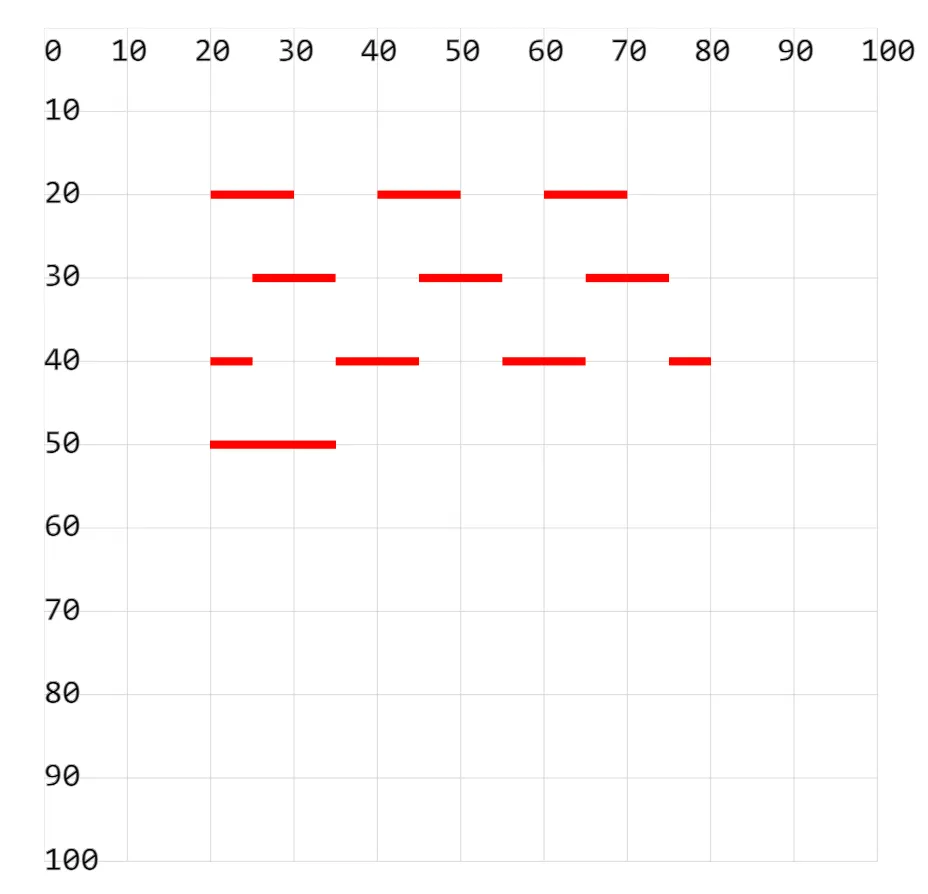

# [0026. 使用属性 stroke-dashoffset 设置虚线的偏移](https://github.com/tnotesjs/TNotes.svg/tree/main/notes/0026.%20%E4%BD%BF%E7%94%A8%E5%B1%9E%E6%80%A7%20stroke-dashoffset%20%E8%AE%BE%E7%BD%AE%E8%99%9A%E7%BA%BF%E7%9A%84%E5%81%8F%E7%A7%BB)

<!-- region:toc -->

- [1. demos.1 - 使用属性 stroke-dashoffset 设置虚线的偏移](#1-demos1---使用属性-stroke-dashoffset-设置虚线的偏移)

<!-- endregion:toc -->

- stroke-dashoffset、stroke-dasharray 这两个属性配合使用，可以实现一些常见的线条移动的动画效果。

## 1. demos.1 - 使用属性 stroke-dashoffset 设置虚线的偏移

```xml
<!--
stroke-dashoffset：配合虚线描边属性，设置虚线开始的位置（偏移）。
正数向左偏移
负数向右偏移

应用：
1. 可以用来实现横向滚动广告效果。
2. 可以用来实现进度条效果。
3. 可以用来实现其他线条移动的动画效果。
-->
<svg style="margin: 3rem;" width="500px" height="500px" viewBox="0 0 120 120" xmlns="http://www.w3.org/2000/svg">
  <path d="M20 20H80" fill="none" stroke="red"
    stroke-width="1" stroke-dasharray="10" /> <!-- [!code highlight] -->
  <path d="M20 30H80" fill="none" stroke="red"
    stroke-width="1" stroke-dashoffset="-5" stroke-dasharray="10" /> <!-- [!code highlight] -->
  <path d="M20 40H80" fill="none" stroke="red"
    stroke-width="1" stroke-dashoffset="5" stroke-dasharray="10" /> <!-- [!code highlight] -->
  <path d="M20 50H80" fill="none" stroke="red"
    stroke-width="1" stroke-dashoffset="45" stroke-dasharray="60" /> <!-- [!code highlight] -->
</svg>
```


