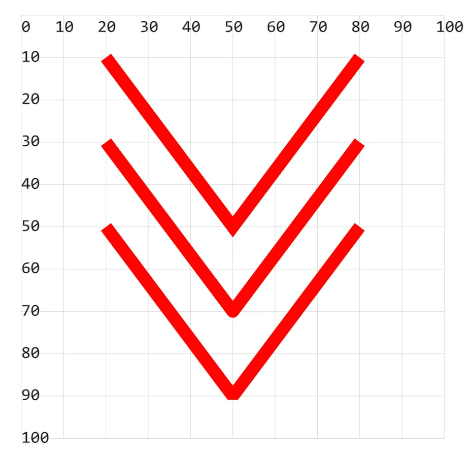

# [0027. 使用属性 stroke-linejoin 设置线条连接处样式](https://github.com/tnotesjs/TNotes.svg/tree/main/notes/0027.%20%E4%BD%BF%E7%94%A8%E5%B1%9E%E6%80%A7%20stroke-linejoin%20%E8%AE%BE%E7%BD%AE%E7%BA%BF%E6%9D%A1%E8%BF%9E%E6%8E%A5%E5%A4%84%E6%A0%B7%E5%BC%8F)

<!-- region:toc -->

- [1. demos.1 - 使用属性 stroke-linejoin 设置线条连接处样式](#1-demos1---使用属性-stroke-linejoin-设置线条连接处样式)

<!-- endregion:toc -->

- miter `>` 尖角
- round `)` 圆角
- bevel `]` 平角

## 1. demos.1 - 使用属性 stroke-linejoin 设置线条连接处样式

```xml
<!--
stroke-linejoin：设置折线连接点的形状
  miter 尖角（默认）
  round 圆角
  bevel 平角
-->
<svg style="margin: 3rem;" width="500px" height="500px" viewBox="0 0 120 120" xmlns="http://www.w3.org/2000/svg">
  <polyline points="20 10,50 50,80 10" stroke="red" stroke-width="3" fill="none" stroke-linejoin="miter" />
  <polyline points="20 30,50 70,80 30" stroke="red" stroke-width="3" fill="none" stroke-linejoin="round" />
  <polyline points="20 50,50 90,80 50" stroke="red" stroke-width="3" fill="none" stroke-linejoin="bevel" />
</svg>
```


