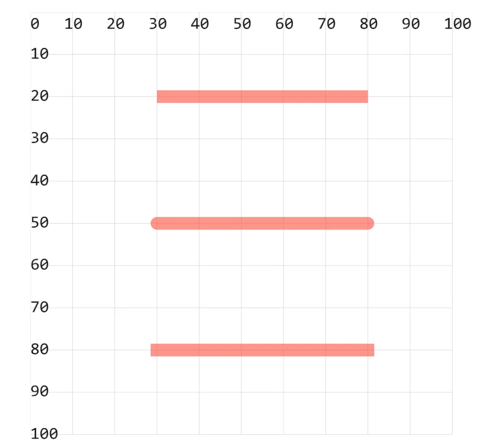

- stroke：设置描边颜色（边框）
- stroke-width：设置描边粗细
- stroke-opacity：设置描边颜色的透明度
- stroke-linecap：设置线段两端的形状

## 1. demos.1 - 使用 stroke 相关属性设置描边样式

```xml
<!--
stroke：设置描边颜色（边框）
stroke-width：设置描边粗细
stroke-opacity：设置描边颜色的透明度
stroke-linecap：设置线段两端的形状
  butt 直边（默认）
  round 圆角边
  square 矩形边
    视觉效果与 butt 类似。
    两端使用了矩形形状，与 butt 效果相比会长出一块。
-->
<svg style="margin: 3rem;" width="500px" height="500px" viewBox="0 0 120 120" xmlns="http://www.w3.org/2000/svg">
  <line x1="30" y1="20" x2="80" y2="20" stroke="red" stroke-width="3" stroke-opacity=".5" stroke-linecap="butt" />
  <line x1="30" y1="50" x2="80" y2="50" stroke="red" stroke-width="3" stroke-opacity=".5" stroke-linecap="round" />
  <line x1="30" y1="80" x2="80" y2="80" stroke="red" stroke-width="3" stroke-opacity=".5" stroke-linecap="square" />
</svg>
```


