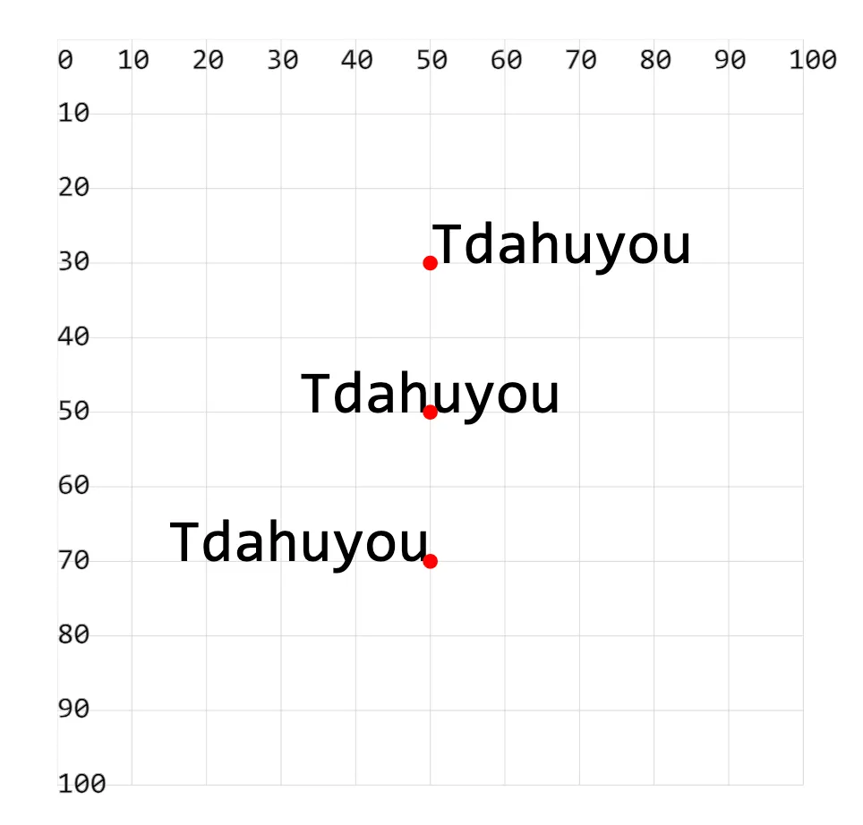

- 属性 `text-anchor` 用于设置文本的水平对齐方式。

## 1. demos.1 - 控制文本的水平对齐方式

```xml
<!--
text-anchor：基于 (x, y) 坐标位置设置文本锚点。

属性值：
start   以 (x, y) 坐标为【开始】位置
middle  以 (x, y) 坐标为【中间】位置
end     以 (x, y) 坐标为【结束】位置
-->
<svg style="margin: 3rem;" width="500px" height="500px" viewBox="0 0 120 120" xmlns="http://www.w3.org/2000/svg">

  <text font-size="8" x="50" y="30" text-anchor="start">Tdahuyou</text> <!-- [!code highlight] -->
  <text font-size="8" x="50" y="50" text-anchor="middle">Tdahuyou</text> <!-- [!code highlight] -->
  <text font-size="8" x="50" y="70" text-anchor="end">Tdahuyou</text> <!-- [!code highlight] -->

  <!-- 辅助点 -->
  <circle cx="50" cy="30" r="1" fill="red" />
  <circle cx="50" cy="50" r="1" fill="red" />
  <circle cx="50" cy="70" r="1" fill="red" />
</svg>
```


