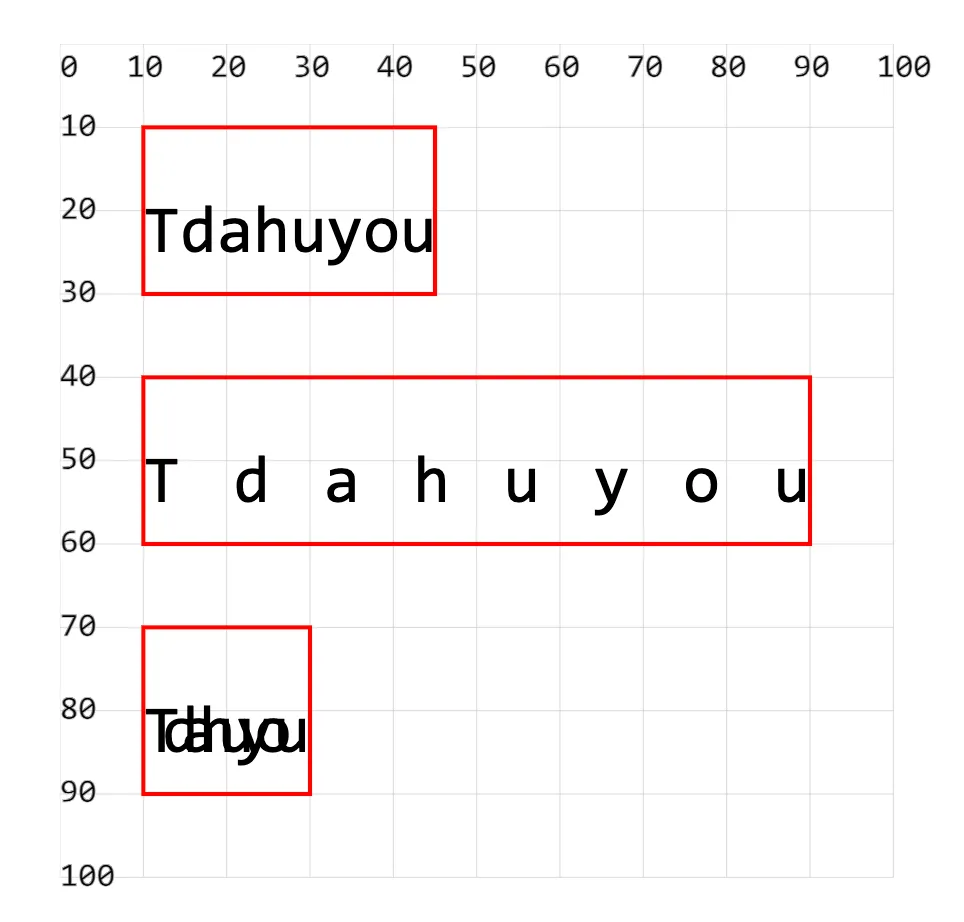

- 属性 `textLength` 用于设置文本的长度
  - 长度过大，文本拉伸
  - 长度过小，文本压缩

## 1. demos.1 - 约束文本长度

```xml
<!--
textLength 设置文本书写的空间的长度。

文本长度 > 空间长度   压缩文字
文本长度 < 空间长度   发散文字

注意：
不要将 textLength 错写为 text-length，后者是错误的写法。
-->
<svg style="margin: 3rem;" width="500px" height="500px" viewBox="0 0 120 120" xmlns="http://www.w3.org/2000/svg">

  <!-- 正常 宽度自适应文本 -->
  <text font-size="8" x="10" y="25">Tdahuyou</text> <!-- [!code highlight] -->
  <!-- 文本长度 < 空间长度 -->
  <text font-size="8" x="10" y="55" textLength="80">Tdahuyou</text> <!-- [!code highlight] -->
  <!-- 文本长度 > 空间长度 -->
  <text font-size="8" x="10" y="85" textLength="20">Tdahuyou</text> <!-- [!code highlight] -->

  <!-- 辅助框 -->
  <rect x="10" y="10" width="35" height="20" fill="none" stroke="red" stroke-width=".5" />
  <rect x="10" y="40" width="80" height="20" fill="none" stroke="red" stroke-width=".5" />
  <rect x="10" y="70" width="20" height="20" fill="none" stroke="red" stroke-width=".5" />
</svg>
```


