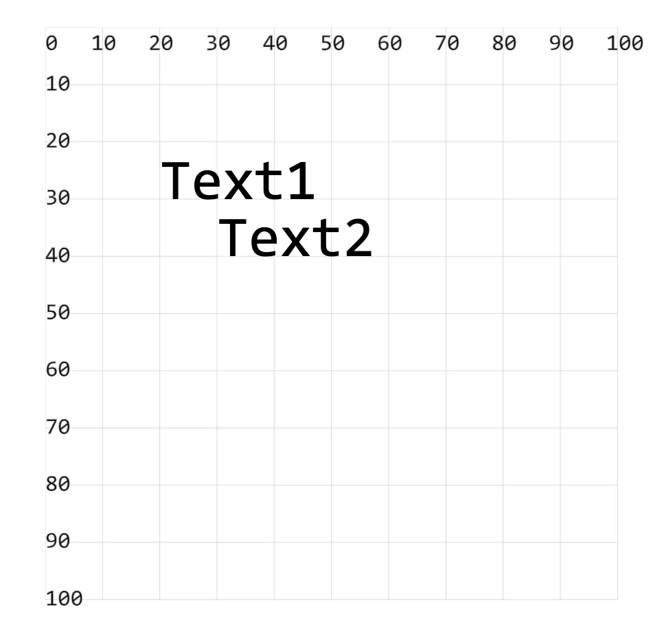

- x、y、dx、dy 这些属性决定了绘制文本的位置。其中 x、y 属性决定了文本的左上角位置，而 dx、dy 属性决定了文本的偏移量。

## 1. demos.1 - 使用属性 x、y、dx、dy 控制文本的绘制位置

```xml
<!--
x="20" y="30"
x：表示文本左边和 y 轴的距离
y：表示文本底边和 x 轴的距离

dx="10" dy="10" 表示偏移量
dx：表示文本左边相对于 x 值的距离（如果 x 是 20，那么 dx="10" 意味着文本将在 x 为 30 处开始绘制）
dy：表示文本底边相对于 y 值的距离（如果 y 是 30，那么 dy="10" 意味着文本将在 y 为 40 处开始绘制）
-->
<svg style="margin: 3rem;" width="500px" height="500px" viewBox="0 0 120 120" xmlns="http://www.w3.org/2000/svg">
  <text x="20" y="30" font-size="10">Text1</text> <!-- [!code highlight] -->
  <text x="20" y="30" dx="10" dy="10" font-size="10">Text2</text> <!-- [!code highlight] -->
</svg>
```

- 
