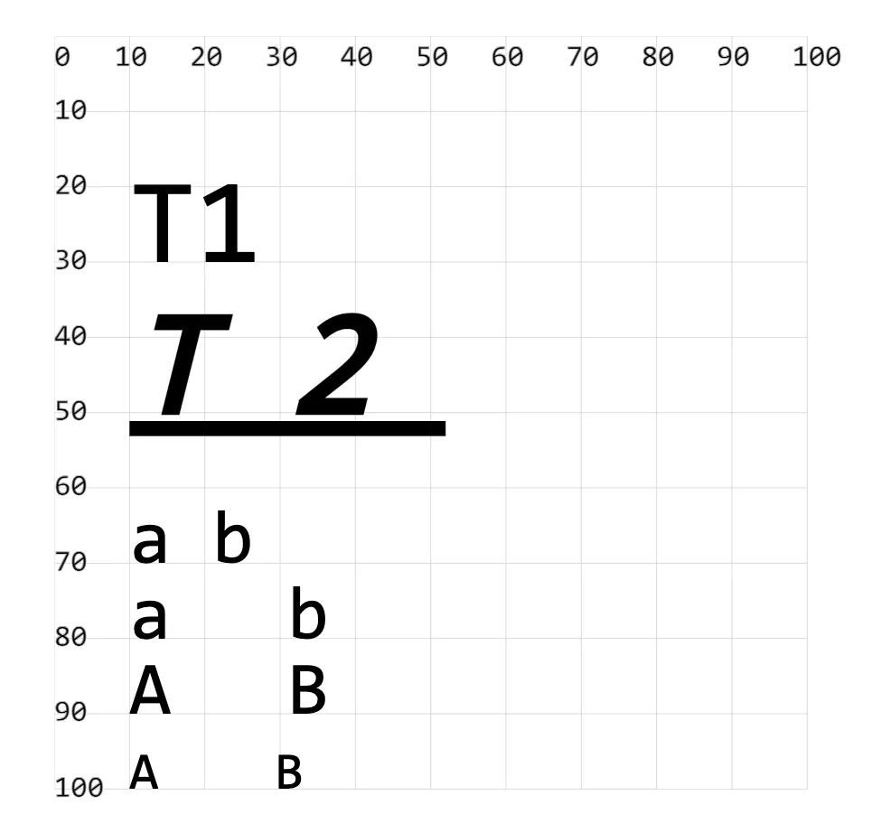

- fill：设置字体颜色
- font-size：设置文字大小
- font-family：设置字体
- font-style：设置斜体
- font-weight：设置粗体
- text-decoration：设置文本装饰
  - 下划线：underline
  - 上划线：overline
  - 删除线：line-through
- letter-spacing：设置每一个字母之间的距离
- word-spacing：设置每一个单词之间的距离
- font-variant：设置文字变体
  - small-caps 转大写，不过是小型的大写字母

## 1. demos.1 - 设置文本样式

```xml
<!--
fill：设置字体颜色

font-size：设置文字大小

font-family：设置字体

font-style：设置斜体

font-weight：设置粗体

text-decoration：设置文本装饰
  下划线：underline
  上划线：overline
  删除线：line-through

letter-spacing：设置每一个字母之间的距离

word-spacing：设置每一个单词之间的距离

font-variant：设置文字变体
  small-caps 转大写，不过是小型的大写字母
-->
<svg style="margin: 3rem;" width="500px" height="500px" viewBox="0 0 120 120" xmlns="http://www.w3.org/2000/svg">
  <text x="10" y="30">T1</text> <!-- [!code highlight] -->
  <text x="10" y="50" // [!code highlight]
    font-size="20" font-family="楷体" font-style="italic" font-weight="bold" text-decoration="underline" // [!code highlight]
    letter-spacing="10" word-spacing="10">T2</text> <!-- [!code highlight] -->
  <text x="10" y="70" font-size="10">a b</text> <!-- [!code highlight] -->
  <text x="10" y="80" font-size="10" word-spacing="10">a b</text> <!-- [!code highlight] -->
  <text x="10" y="90" font-size="10" word-spacing="10">A B</text> <!-- [!code highlight] -->
  <text x="10" y="100" font-size="10" word-spacing="10" font-variant="small-caps">a b</text> <!-- [!code highlight] -->
</svg>
```


