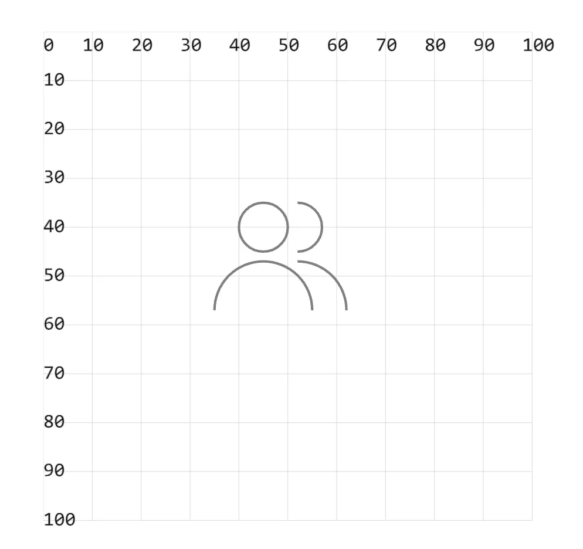

- 本节涉及的知识点：使用 `path` 标签来绘制弧。
  - `svg.0011`
- 能够理解这个群的图标其实就是通过几段弧绘制出来的即可。

## 1. demos.1 - 绘制「群」图标

```xml
<svg style="margin: 3rem;" width="500px" height="500px" viewBox="0 0 120 120" xmlns="http://www.w3.org/2000/svg">
  <!-- 群 -->
  <path d="M 40 40 A 5 5 0 0 1 50 40 A 5 5 0 0 1 40 40
       M 35 57 A 10 10 0 0 1 55 57
       M 52 35 A 5 5 0 0 1 52 45
       M 52 47 A 10 10 0 0 1 62 57"
  fill="none" stroke="gray" stroke-width=".5" />
</svg>
```


