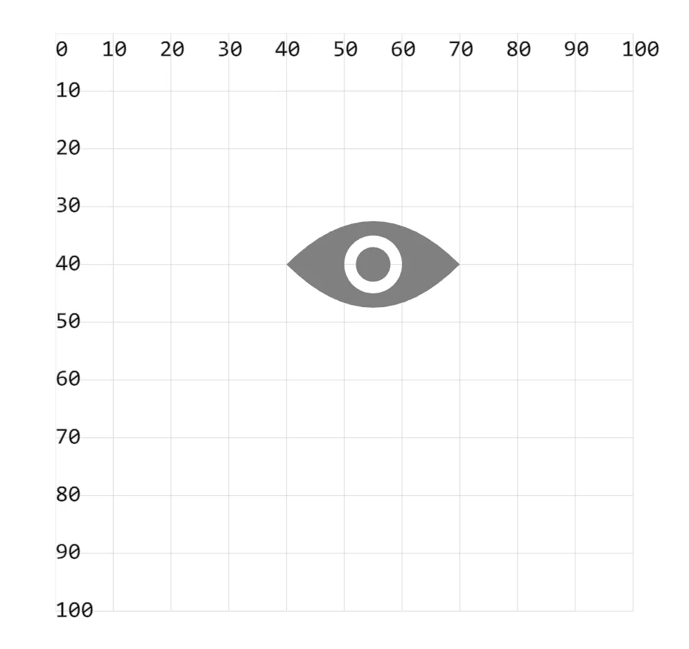

- 绘制眼睛图标时，中心有一个镂空的圆环。要弄清楚为什么这块的内容是镂空的，需要理解填充规则 nonzero 和 evenodd。

## 1. demos.1 - 绘制【眼睛】图标

```xml
<svg style="margin: 3rem;" width="500px" height="500px" viewBox="0 0 120 120" xmlns="http://www.w3.org/2000/svg">
  <!-- 眼
  在绘制内层圆的时候，需要注意绘制的方向。
  fill 的区域跟我们绘制的方向是有关系的。
  -->
  <path d="M 40 40 C 50 30, 60 30, 70 40
    C 60 50, 50 50, 40 40
    M 50 40 A 5 5 0 0 0 60 40
    A 5 5 0 0 0 50 40
    M 52 40 A 3 3 0 0 1 58 40
    A 3 3 0 0 1 52 40"
    fill="gray" />
</svg>
```


